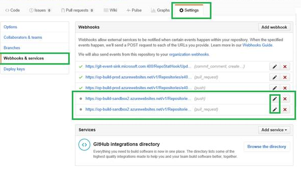
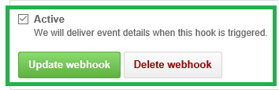

# Accessing PPE remotely

Currently, pages in the PPE environment are only visible from corpnet or via VPN/DirectAccess.

If you are on corpnet, PPE links should open normally.

If PPE shows out-of-date content, your webhooks for the sandbox environment may not be activated.  To fix the problem:

1. In your repo on GitHub, click the Settings tab.
2. In the left nav, click Webhooks & services.
3. Locate the two sandbox webhooks, typically at the bottom of the list.

    
    
4. Click on each, check the Active checkbox, and click Update webhook.

    
