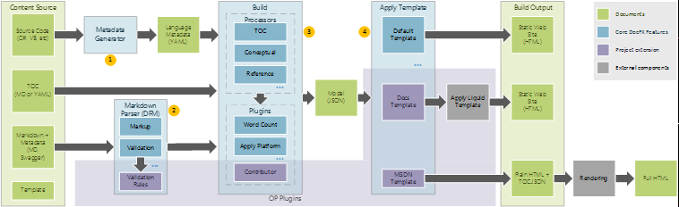
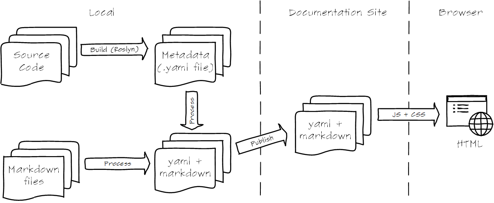
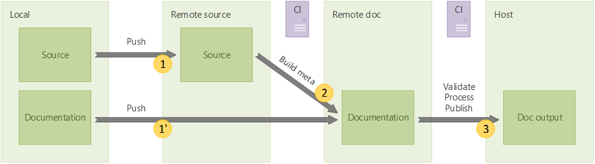

# Managed Reference
Managed reference is generated using DocFx (a modern API documentation generator). More information at [http://dotnet.github.io/docfx/](http://dotnet.github.io/docfx/).

## Supported Languages
C# and VB

## Workflows

### Authoring

### Publishing

