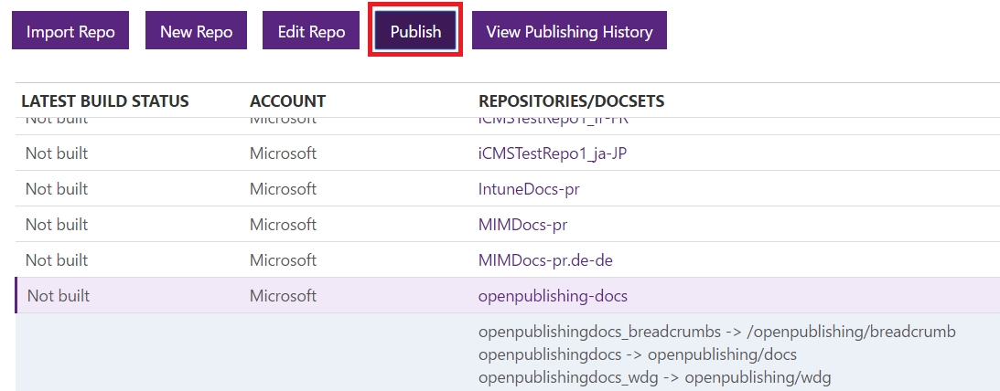
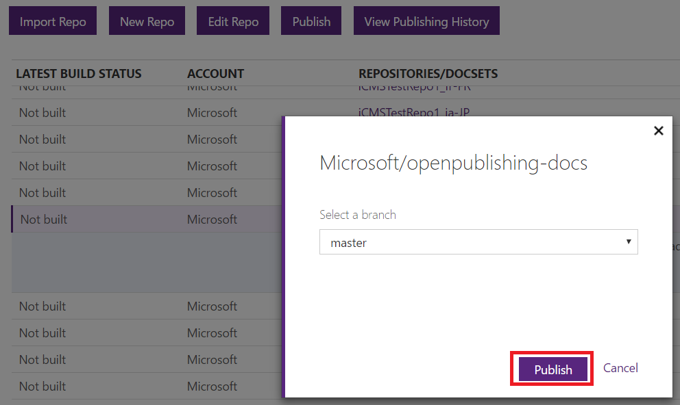
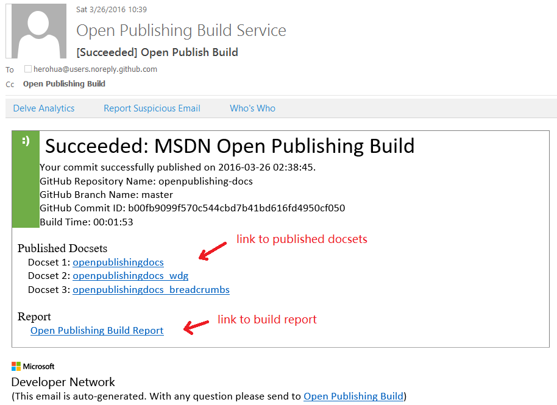
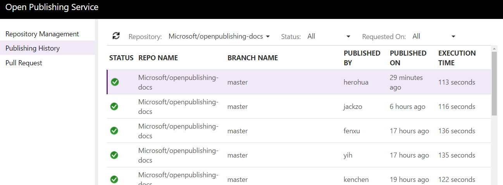
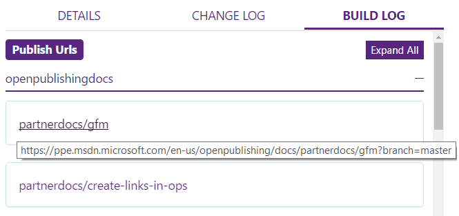
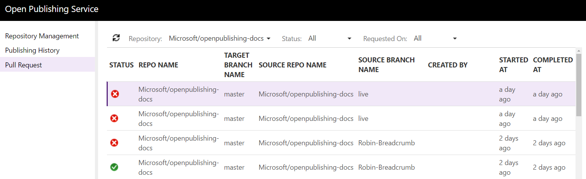
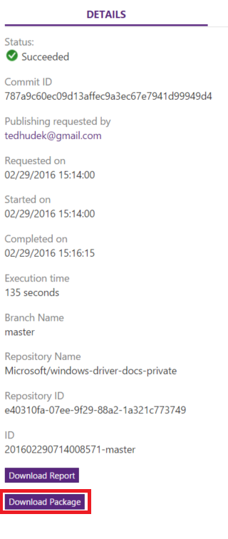

# Content Publishing

Alike other systems, publishing to stage and live is done via branch management. Thus, you can assign one branch to be your sandbox, staging branch, and another to be your live branch. This is configured during [repo provisioning](../engdocs/repo-provision.md). 

In general:

- **master** branch is the branch associated with staging.
- **live** branch is the production branch associated with live.

Note that this means that once the content is committed to one of the corresponding branch, the content will automatically get published to their assigned environment. 

Both English and localized content follow the same logic for a given repo.

## Trigger content publishing

+ Auto publish on content update in Git repo

Once the repo is provisioned, OPS monitors changes in the repo and publishes the contents in updated branch automatically.

> [!NOTE]
> By default, all branches are monitored for auto publishing.
> You may disable monitoring on a specific branch by setting [branches_to_filter](publish-configuration.md#publish-config-branches_to_filter) in publish configuration.

+ Manually trigger publish on OPS portal

Alternatively, you may trigger a publish on OPS portal.

On `Repository Management` tab, choose the Git repo you would like to trigger publish. Click `Publish`.

On the pop-up window, select the branch from the pull-down list. Then click `Publish`.

## Validation build for pull request

Validation build is automatically triggered when a pull request is opened.

## Build status and reports

+ Notification mail

The submitter of the changes as well as those in the [notification list](publish-configuration.md#publish-config-notification_subscribers), will get a mail indicating whether the build is successful or not, a link to the documentation, as well as a link to the build report.

+ Publishing history on OPS portal

Alternatively, teams can look at the OPS portal for build status and logs of current and past publishes.

For each entry in the publishing history, you may find build status, change log and build log on the right panel. Note that published URLs can be found on `BUILD LOG` tab.

+ Validation build history on OPS portal

Similarly, there is a `Pull Request` tab on portal showing status of current and past validation builds for pull request.

## PDF build output

> [!NOTE]
> Make sure you have turned on the build of PDF in [publish configuration](publish-configuration.md#publish-config-need_generate_pdf).

When publish or build of pull request finishes, open OPS portal and go to `Publishing History` or `Pull Request` tab. There is a `Download Package` link in the `DETAILS` tab. Click `Download Package`.

After download finishes, unzip the downloaded package. The generated pdf(s) are in the folder. Each docset will be built into a PDF named by `{docset name}.{locale}.v{version}.pdf`.
