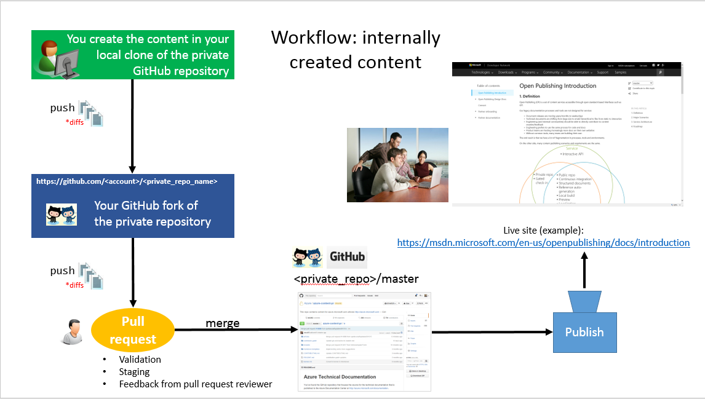
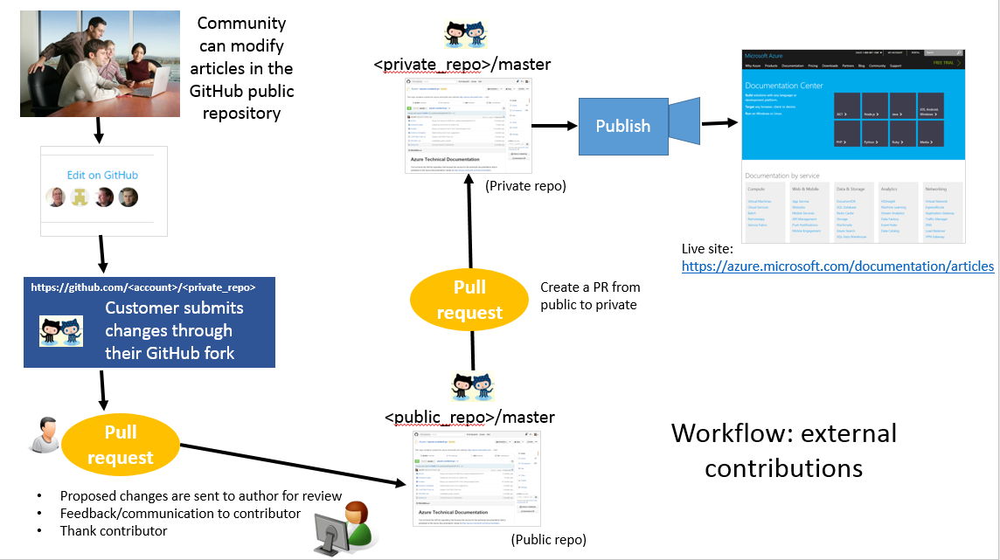

# Creating the GIT repos
It is the content owner's responsibility to create the GIT repos and provide the right permissions to the users to access them. 
A GIT repo is either GitHub or Visual Studio Online.

If you are not familiar with GitHub, check out a summary of [GitHub terminology](GitHub-terminology.md) used in this documentation as well as the [GitHub tutorials](https://github.com/)

- For GitHub repository setup, follow the [GitHub tutorials](https://help.github.com/articles/set-up-git/).
- For Visual Studio Online see (TBD).

##1. Create the repo
1. The first step is to create a GIT repository.
2. Make sure you add a readme.md file to the repo. You will need this file to tell your users how to contribute to the repo.
3. Decide whether the repo is going to be public or private.

### 1.1 GitHub Private vs. public repo

If you do not want/need external contributions (i.e. external to Microsoft), you would need create a private repo.
If you want/need external contributions (i.e. external to Microsoft), then you would need to create two repos: one public and one private.

- The private repo will contain the under development content, that is, the content that your customers cannot see. 
- The public repo will contain the content that is widely available, which your customers can contribute to. Note, even if you have not published you content live, anything in the public repo will be visible to external users.

**If you have a public and private repo, both repos need to have the same structure in order to enable external collaborations in the public repo.**

You can also create a private fork out of your private repo. This [article](https://opensourcehub.microsoft.com/articles/github-create-private-fork-of-public-repo) shows you how. 

If you create both kinds of repo (private and public), you need to manually synchronize your private repo to your public repo when you are ready to make the content available to your customers. 
Here is a recommendation:  

- Pull the changes made in the public repo into a local branch of the private repo. 
- Fix any merge conflicts and submit a pull request to the [master](GitHub-terminology.md) branch in the private repo.
- Once the pull request passes validation, merge it to the master branch in the private repo. 
- Create a pull request to add the info from the private repo into the public repo. Revolve any conficts.
- Once the two repos have synced, you can publish the content you merged in from the public repo.
 
As Open Publishing offers local preview, you can always pull changes from the public repo to your private repo to have a full view of your content. 

The following two images show a graphical view of the recommended workflow by the Azure team. Note this is only added here for your reference.

#### 1.1.1 Internal contributions only workflow

#### 1.1.2 External contributions workflow

  
## 2. Creating your repo in the Microsoft GitHub Organization
We recommend that you create the repo in the Microsoft GibHub Organization. That way, all Microsoft repos are together in a single GitHub organization. Also you can benefit of all the advantages the organizaiton provides, including enabling Contributaion License Agreement (CLA) automation. 

First, you will have to join the Microsoft GitHub organization. [Here is how](https://www.1eswiki.com/wiki/How_to_Join_the_Microsoft_GitHub_Organization).

Then create your repo. See [How to Create a Repo in the Microsoft GitHub Organization](https://opensourcehub.microsoft.com/articles/how-to-create-new-repo-in-microsoft-github-org-self-service) for details.

When creating the organization, choose:
1. MIT license
2. Choose **Sample code exception** unless your repo will also have samples. 

You can enable [Contribution License Agreement (CLA) automation](https://opensourcehub.microsoft.com/articles/automating-cla-signing), a service account will automatically check a user's pull request and ask you to sign CLA if necessary.

## 3. Setting up permissions to the GIT repo
For permission to access the content repo, the content owner is responsible for leveraging GITHUB permission system. The owner will need to give the appropriate users read or write permission to the repo (private or public). Our recommendation is you create an org and host the repo under that org, then add users to that org to give them write permission. 

Users are always able to publish by pushing a change to a branch, as long as they have the push permission to the repo.

To learn more about repo permissions in GitHub, please see the (Repository permission levels for an organization page)[https://help.github.com/articles/repository-permission-levels-for-an-organization/]. 

IMPORTANT: In order for VSC to configure your repo, 
* Grant admin permissions to "OPS_Admin" team. Only administrators of the repo can configure it. 
* Grant read permissions to "VSC-Eng-Team". This is our engineering team account that would need access for any troubleshooting in your repo. 
* If you are outside the Microsoft organization, then you need to add "OPS_Admin" to be admin in the organization. This is because we will need to have a couple of tools granted access to the repo in order to make the build work.  
* Please enter a bug for either Open Publishing or docs via [MSDNHelp portal](http://MSDNHelp) for our team to provision your repo. Information that we need:
 * Repo URL
 * [Base URL](URL-management.md) you would like to have
 * End point
 * Do you need APIScan or not
 * Priority:
    * P1 - 1 business day
    * P2 - 2 business days
    * P3 - 3-5 business days
 
Also, for any contributor, specially Microsoft employees, please ask them to have their company added to their profile. This will help our team to classify which one are coming from Mirosoft and which oens are coming from outside.

## 5. Next: Configure your repo
[Configure your repo](repo-config.md)
