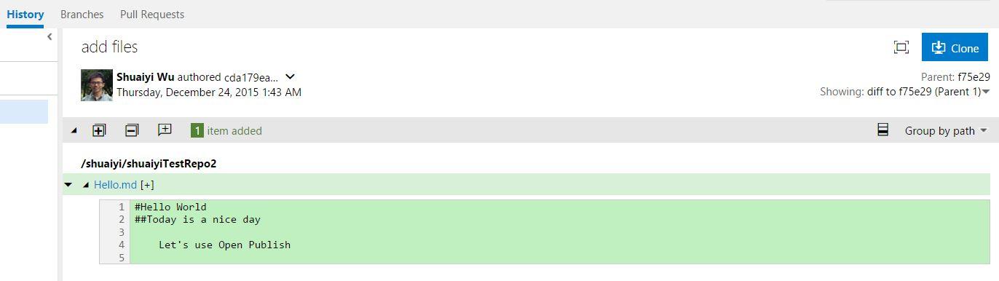

#I want to create a Git and OP repository on portal

In this article, I will create both a Git and OP repository by the OP portal.

in this article:

- Login with GitHub/Vso
- New Repo
- New Docsets
- Manual Publish
- Check Points

This scenario will start from **Git and OP repository create** to **rendering show**.

##STEP1: Login with GitHub/Vso

- Operation:

	On the right of the portal, login with GitHub firstly.

	

##STEP2: New Repo

- Operation:
	
	
	
	To begin with, click **New Repo** on the OP portal.
	
	
	
	In this pop up view, only **Repository Name** is required.
	
	Organization, Private Repository and Notification Subscribers is optional.
	
	- Repository Name: It should be a valid GitHub repository name, only contains character, number, underline and hyphen. e.g. "petulant-waffle" is a valid GitHub repository name.
	- Organization: Choose an organization which the repository belong to.
	- Notification Subscribers: It's a mail list that every mail address in the list will receive all the activities like build result from Open Publish Service. It can be modified later in `.openpublishing.publish.config.json` .
	
	Login with GitHub
	
	- Private Repository: Check this for a private GitHub repository.
	
	Login with Vso
	
	- Project: specify the project which the repository belong to.
	
	When you finish it, and click **Next**.
	
- Validation:

	validate repository with docsets together should be after step3.

##STEP3: New Docsets

- Operation:

	
	
	In the docsets create view. I'm going to create a docset belong to this repository.
	
	Note that **Docset Name**, **Base Path**, **Locale**, **Version** and **Tenant** is required.
	
	Site Name, Area, Theme and Public Contributors is optional.
	
	- Docset Name: The name of the docset.
	- Base Path: The base path of the docset. e.g. 'a', 'a/b'. The relative URL of published pages is the combination of base path and local path.
	- Locale: The local of the docset.
	- Version: The version of the docset.
	- Tenant: The Tenant of the docset.
	- Site Name: The name of publishing site.
	- Area: The area of the docset. Area and theme determine the the styles of published pages.
	- Theme: The theme of the docset. Area and theme determine the the styles of published pages.
	
	
	Login with GitHub:

	- Public Contributors: Specify whether the docset is open to public contributors. When true, publish pages contain a hyperlink to jump to the source document on GitHub/Vso.
	
	when you finish it, and click **Provison** which will lead portal to create a both GitHub and OP repository now.

- Validation:

	[Check point 1](#check-point-1): Check the created repository and docsets.

##STEP4: Manual Publish

- Operation:

	- Preparation before publish
	
		Login with GitHub:

		
	
		Login with Vso:

		

		Before you are going to publish your repository, you need prepare a Markdown file to publish. e.g. "Hello.md". For GitHub, It's OK to create this file on GitHub or use command line tool. For Vso, you may need push the sample file by command line tool.
	
		
	
		In the article, feel free to write in Markdown.
	
	- Manual publish
	
		
	
		Back to OP portal, select the repository you want to publish, and click "publish" button. You'll see this view. This time, you need to choose a branch to publish. The provision branch is always `live` branch, but the publish branch can be changed.
	
			
	
		In the publishing history, you can see the status is processing. Wait for a moment, and you can see the status is `Succeed`, `SucceededWithWarning ` or `Failed `. 
	
		Now, all the maill adress in the Notification Subscribers will receive a build result mail. You can refer to the OP report for more details.
	
		
	
		In the build log which you can find it in publishing history, you can see all the articles which have published. 
	
		We've created a Markdown file "Hello" before, so the "Hello" is published on [Published Hello](https://ppe.msdn.microsoft.com/en-us/shuaiyi/spec-docset/Hello?branch=live). 
	
		Here's the final result.
	
		
	
- Validation:
	
	[Check point 2](#check-point-2): Check the published site.

##Check Points

###Check Point 1: Check the created repository and docsets

* Check on OP portal
		
	Check repository with the specified repository name whether exist
		
	

	The **Repository Name** in the first line shows on the OP portal must be same as what we've configured.

	The **Docset Name** and **Base Path** in the second line show on the OP portal must be same as what we've configured.

* Check on GitHub if login with GitHub
	
	Redirect to GitHub repository url to find whether a OP ropository is created on GitHub

	By clicking on the repository name on OP portal, you'll redirect to GitHub page with the specified repository.

	

	In this page, you need to check the files and directories as the following to make true it is a **OP repository** created.
		
	* Flie `.openpublishing.publish.config.json`  
	* Flie `.openpublishing.build.ps1`
	
	
	
	Enter the docset folder on GitHub, and you need to check these files in this folder.
	
	* File `TOC.md`
	* File `docfx.json`

	

	In the Webhooks & services setting of the repository, you need to check these two **webhooks** whether created.

	* Webhook: `push`
	* Webhook: `pull_request`

* Check On Vso if login with Vso
	
	

	Do the same operation redirect to Vso and check same files.

	

	In the Service Hooks of the repository, you need to check these three **webhooks** whether created.

	* Webhook event: `pull request created`
	* Webhook event: `pull request updated`
	* Webhook event: `Code pushed`

###Check Point 2: Check the published site
	
* Check on OP portal
	
		

	* Check filter on OP portal
	
		To check the filter, you may need select the specific repository like the example "spec-repo", the status "Succeeded" and request time "Last 1 week". The query result should be consistent with what we expected. It's better to have more tries to check the filter on OP portal.

		Now that we've published the repository "spec-repo", go to publishing history to find this repository whether successfully published. And the publish status must be `Succeeded`.
	
	* Check Build Log on OP portal
	
		

		In the Publish History -> Build Log, click "Expand All" and you need check all the published sites. 

* Check a successfully published mail
	
	

	This step, to check your mailbox which is setted in notification subscribers before. You'll receive this mail that means it is a successful publish.

* Check Change Log on OP portal and GitHub/Vso

	

	In the Publish History, select the build and click the Chang Log.

	

	If login with GitHub, go to GitHub and find the latest commit, it should be the changes we made.

	Then compare the Change Log on OP portal and it on GitHub. You need to check **Commit ID**, **Files changes** and **Commit message** should be totally same between OP poratal and GitHub.

	

	Do the same check on Vso if login with Vso.
	
* Check on MSDN site

	You can click the published docsets url either on mail or build log on OP portal.

	And you need check whether the published **docset** is same as it in GitHub repository that means the content of "Hello" is same between published MSDN page and it on GitHub.

