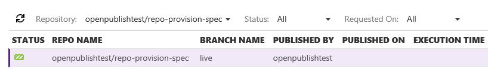

#I want to provision a Git repository on portal

In this article, I will provision a GitHub repository on portal.

in this article:

- Login with GitHub/Vso
- Import Preparation
- Import Repo
- Manual Publish
- Check Points

This scenario will start from **Git repository import** to **rendering show**.

##STEP1: Login with GitHub/Vso

- Operation:

	On the right of the portal, login with GitHub firstly.

	

##STEP2: Import Preparation

- Operation:
	
	- Login with GitHub
	
		
	
		To begin with, you should make true you've prepared configurations correctly which you can refer to the [Sample Repository](https://github.com/openpublishtest/spec-repo).
	
		- `.openpublishing.publish.config.json`
		- `.openpublishing.build.ps1`
		- Docset folder
		
		And please don't forget to **update** by your specific `docset_name` and `build_output_subfolder` in `.openpublishing.publish.config.json `.
	
		Also, `dest` in `spec-repo/shuaiyi/spec-docset/docfx.json` could be same as `build_output_subfolder`.
	
		Before that, the default provision is `live` branch, make true that you've prepared on this branch. If not, you need create the `live` branch and prepare configurations on it.

	- Login with Vso
		
		Prepare same config files as login with GitHub.

##STEP3: Import Repo

- Operation:

	
	
	Click **Import Repo** on the OP portal.

	

	In this pop up view, firstly, select the repository that you've prepared on GitHub which is "repo-provision-spec" for example. Then select the docset to publish and configure it.

	Note that **Tenant** and **Base Path** is required.
	
	Site Name, Area and Theme is optional.

	- Site Name: The name of publishing site.
	- Area: The area of the docset. Area and theme determine the the styles of published pages.
	- Theme: The theme of the docset. Area and theme determine the the styles of published pages.
	- Tenant: The Tenant of the docset.
	- Base Path: The base path of the docset. e.g. 'a', 'a/b'. The relative URL of published pages is the combination of base path and local path.
	
	When you finish it, and click **Provision**.
	
- Validation:
	
	[Check point 1](#check-point-1): Check the created OP repository and docsets on OP portal.

##STEP4: Manual Publish

- Operation:
	
	- Manual publish
	
		
	
		On the OP portal, select the repository you want to publish, and click "publish" button. You'll see this view. This time, you need to choose a branch to publish. The provision branch is always `live` branch, but the publish branch can be changed.
	
			
	
		In the publishing history, you can see the status is processing. Wait for a moment, and you can see the status is `Succeed`, `SucceededWithWarning ` or `Failed `. 
	
		Now, all the maill adress in the Notification Subscribers will receive a build result mail. You can refer to the OP report for more details.
	
		
	
		In the build log which you can find it in publishing history, you can see all the articles which have published. 
	
		We've created a Markdown file "Hello" before, so the "Hello" is published on [Published Hello](https://ppe.msdn.microsoft.com/en-us/shuaiyi/spec-provision-docset/Hello?branch=live). 
	
		Here's the final result.
	
		
	
- Validation:
	
	[Check point 2](#check-point-2): Check the published site.

##Check Points

###Check Point 1: Check the created repository and docsets on OP portal
	
- Check repository with the specified repository name whether exist
		
	
	
	- **Repository Name** in the first line shows on the OP portal must be same as what we've configured.
	
	- **Docset Name** and **Base Path** in the second line show on the OP portal must be same as what we've configured.

###Check Point 2: Check the published site

* Check on OP portal
	
		

	* Check filter on OP portal
	
		To check the filter, you may need select the specific repository like the example "spec-repo", the status "Succeeded" and request time "Last 1 week". The query result should be consistent with what we expected. It's better to have more tries to check the filter on OP portal.

		Now that we've published the repository "spec-repo", go to publishing history to find this repository whether successfully published. And the publish status must be `Succeeded`.

	* Check Build Log on OP portal
	
		

		In the Publish History -> Build Log, click "Expand All" and you need check all the published sites. 

* Check a successfully published mail
	
	

	This step, to check your mailbox which is setted in notification subscribers before. You'll receive this mail that means it is a successful publish.

* Check Change Log on OP portal and Git

	

	In the Publish History, select the build and click the Chang Log.

	

	If login with GitHub, go to GitHub and find the latest commit, it should be the changes we made.

	Then compare the Change Log on OP portal and it on GitHub. You need to check **Commit ID**, **Files changes** and **Commit message** should be totally same between OP poratal and GitHub.

	

	Do the same check on Vso if login with Vso.

* Check on MSDN site

	You can click the published docsets url either on mail or build log on OP portal.

	And you need check whether the published **docset** is same as it in GitHub repository that means the content of "Hello" is same between published MSDN page and it on GitHub.
