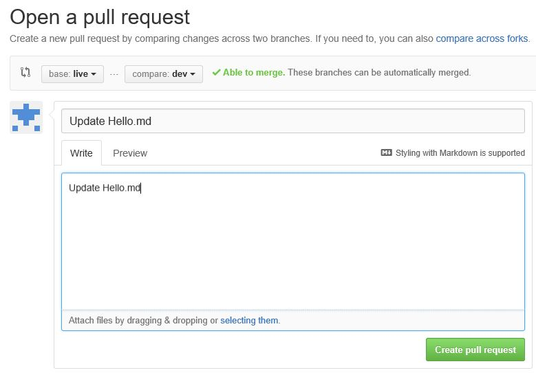
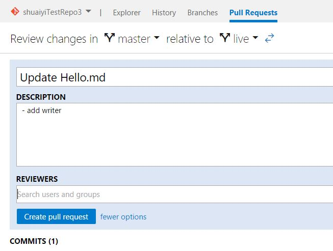
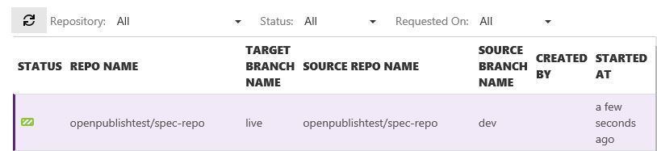
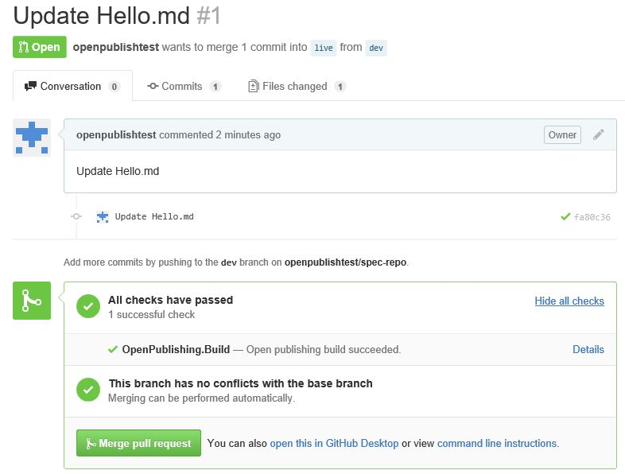

#Trigger a build by new pull request on Git

In this article, I'm going to trigger a build by new pull request on Git.

- New pull request on Git
- Auto trigger a build
- Check Points

This scenario will start from **new pull request** to **publish a build**.

Note: *E2E test has covered this scenario test.*

##STEP1: Push commit on Git

- Operation: 

	- Login with GitHub
		
		

		e.g. push a commit on GitHub in command line, also you can commit on GitHub web site.
	
	- Login with Vso
		
		

##STEP2: Auto trigger a build

- Operation: 

	
	
	In Pull Request, we can find the triggered build, wait for a moment and go to check the published site.

	

	After the build status is succeed, we can find see this page on GitHub. Now we can click the button "Merge pull request" to merge the branch "dev" to "live".

- Validation:

	[Check point 1](#check-point-1): Check the published site.

##Check Points
###Check Point 1: Check the published site

* Refer to Check the published site in [ProvisionRepo](ProvisionRepo.md).