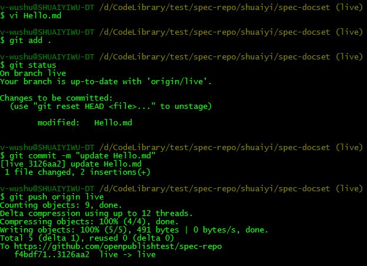

#Trigger a build by push commit on Git

In this article, I'm going to trigger a build by push commit on Git.

- Push commit on Git
- Auto trigger a build
- Check Points

This scenario will start from **push commit** to **publish a build**.

Note: *E2E test has covered this scenario test.*

##STEP1: Push commit on Git

- Operation: 

	

	e.g. push a commit on GitHub or Vso in command line tool. For GitHub, you can also commit on GitHub web site.

##STEP2: Auto trigger a build

- Operation: 

	
	
	In Publish History, we can find the triggered build, wait for a moment and go to check the published site.

- Validation:

	[Check point 1](#check-point-1): Check the published site.

##Check Points
###Check Point 1: Check the published site

* Refer to Check the published site in [ProvisionRepo](ProvisionRepo.md).