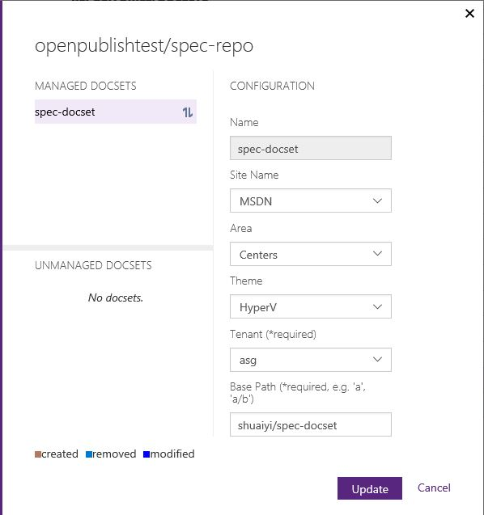

#I want to edit a repository

In this article, I'm going to edit a repository on portal.

- Edit Preparation
- Edit Repo
- Manual Publish
- Check Points

This scenario will start from **Edit repository** to **rendering show**.

##STEP1: Edit Preparation

Before editing the repository, you may need check the **Site Name**, **Area**, **Theme**, **Tenant** and **Base Path** of the specific repository.

- Validation:

	[Check point 1](#check-point-1): Check the configurations before edit the repository.

##STEP2: Edit Repo

- Operation:

	

	In the Repository Management, select the repository you want to edit and click **Edit Repo** on the OP portal.

	

	In this pop up view, firstly, select the docset you want to edit. 

	For **Site Name**, **Area**, **Theme** and **Tenant**, you can choose one in the ComboBox.

	For **Base Path**, you can fill it in the blank. e.g. we'll update it from `shuaiyi/spec-docset` to `public/spec-docset`.

	Note that **Tenant** and **Base Path** is required.
	
	- Site Name: The name of publishing site.
	- Area: The area of the docset. Area and theme determine the the styles of published pages.
	- Theme: The theme of the docset. Area and theme determine the the styles of published pages.
	- Tenant: The Tenant of the docset.
	- Base Path: The base path of the docset. e.g. 'a', 'a/b'. The relative URL of published pages is the combination of base path and local path.

	When you finish it, and click **Update**.

- Validation:

	[Check point 2](#check-point-2): Check the updated repository and docset on OP poratal.

##STEP3: Manual Publish

- Operation:
	
	Refer to STEP4: Manual Publish in [ProvisionRepo](ProvisionRepo.md).

- Validation:

	[Check point 3](#check-point-3): Check the published site.

##Check Points
###Check Point 1: Check the configurations before edit the repository

* Check Base Path on published site
	
	

	Open the published site from portal, you can find the Base Path of the repository from published Url. e.g. `https://ppe.msdn.microsoft.com/en-us/shuaiyi/spec-docset/Hello?branch=live`, the Base Path is `shuaiyi/spec-docset`.

* Check other configurations on published site
	
	TODO: Site Name, Area, Theme and Tenant update is unavailable to check for now.

###Check Point 2: Check the updated repository and docset on OP poratal

Again click editing the repository, you need check whether the updated configurations of the docsets is same as what we've updated before.

**Site Name**, **Area**, **Theme**, **Tenant** and **Base Path** is need to check here.

###Check Point 3: Check the published site

* Refer to Check the published site in [ProvisionRepo](ProvisionRepo.md).
* Check Base Path on published site

	

	Open the published site from portal, you can find the Base Path of the repository from published Url. 

	Check the **Base Path** of the specific docset whether updated as our expectation. e.g. the Base Path is updated from `shuaiyi/sepc-repo` to `public/spec-repo`.

* Check other configurations on published site
	
	TODO: Site Name, Area, Theme and Tenant update is unavailable to check for now.