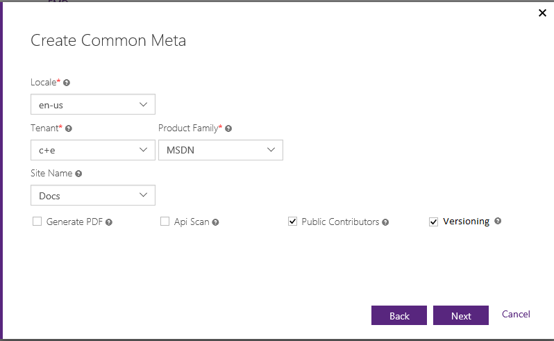
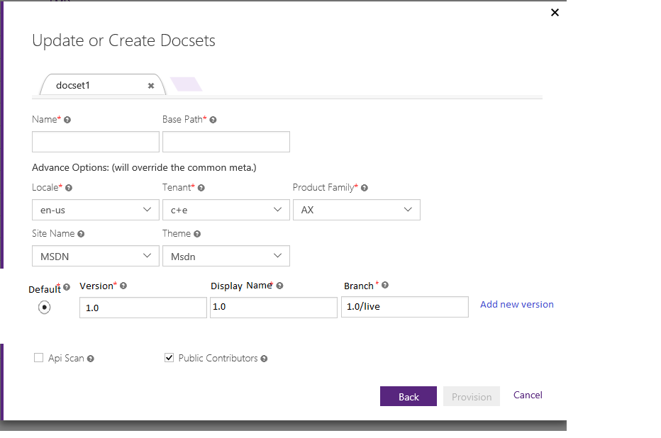
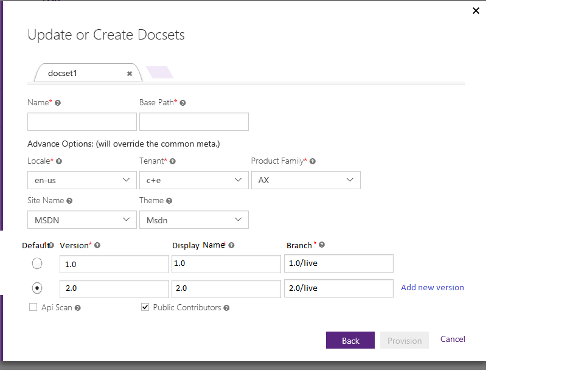

# Open Publishing Versioning Spec (Draft)

## Updates
- June 3rd
    1. Add examples section
    2. Move the configuration from individual branch to global, so branches could be merged easily
    3. Use version *0* for version agnostic docset, keep backwards compatible
    4. Do not cache version information on the client side
    5. Property display the proposed URL structure
- June 6th
    1. Add [Not in Scope](#not-in-scope) section
    2. Add display name of the version
    3. Add [Works not covered in this spec](#works-not-covered-in-this-spec) section
    4. Add URL discussion notes
    5. Move version configuration from Repository to Portal, do not assign version to working branch
- June 9th 
    1. Update the version in URL to be just the version without any additional convention
    2. Update that the version should NOT be cached in browser
- June 14th
    1. Update [Not in Scope](#not-in-scope) section
    2. Add the version in branch name convention proposal to [Discussion](#move-version-related-configuration-to-the-portal)
    3. Add the in page versioning proposal to [Discussion](#in-topic-versioning-or-branch-based-versioning) 
    

## Scenarios
1. Content Producer Scenarios
    - Define the versions of a docset (Portal)
        - A docset could be version agnostic. In this case, the docset would only have version *0*. 
        - A docset could have multiple versions, user should be able to add/remove versions
        - Version must be numeric
    - Define the display name of each version (Portal)
        - The display name of a version could be a user-friendly string, which would be shown in *version selector*
    - Define the branch for each version (Portal)
        - For each individual version, there must be one branch mapped to it, that would be the go-live branch for that version
        - For version *0*, live branch would be the branch mapped to it
    - Select default version (Portal)
        - If the docset has version *0*, then version 0 would be the default version
        - Otherwise the default version would need to be defined
    - Different versions of different docset could be separated in different repositories with different branch name
        - Currently provision same docset (with the same docset name) in different repositories with same base path is supported
> [!Note]
> In our current portal, same docset in multiple branches would have separated configurations, how shall we handle this for versioning?
> If we keep use our current user interface, then it's users' responsibility to keep the configurations in sync, otherwise we will always overwrite the configuration using the latest updated copy.
    - Working branch
        - As only the go-live branches are assigned with version, all the other working/staging branches would not be bind to any specific version
    - Preview
        - Version information should NOT be cached in browser
        - Branch information needs to be cached as the links we're generating today are branch agnostic
        - If version is not specified in URL
            * If branch is either specified in URL or cached, return the content from that branch
            * If branch is neither specified in URL nor cached, return the content from the default version/branch
        - If version is specified in URL
            * If branch is specified in URL, return the content from that branch, so the version specified is not honored
            * If branch is not specified in URL, return the content from the branch of the specified version, regardless of the cached branch value
        - On the preview site, If the content has multiple versions, show both *version selector* and *branch selector*
        
2. Consumer Scenarios
    - If version is not specified in the URL, show the default version content. Do not cache the version information in browser
    - If version is specified in the URL, show the content from the branch of that version. If the version doesn't exist, or the there's no branch configured for that version, return 404.
    - If the content has multiple versions, customer can navigate between those versions via a *version selector*

3. URL and SEO
    - Version as part of the standard URL: ```[<domain>]/(<locale>)/[<base path>]/(<version>)/[<file path>]```
        - Query string is not regarded as good practice for versioning from SEO perspective
        - Version would be included in the URL directly, so user should avoid using numbers as first level folder name under docset root to prevent confusion
        - The version in URL would be the numeric version, not the friendly version name
    - Canonical URL is the versioned URL for each version.
    - Sitemap should include all the versions, while different versions could be assigned with different priority in Sitemap
> [!NOTE]
> Pros and Cons with different canonical URL approaches
> - Version in canonical URL for each single version
>   * Pros
>       - Each version of the content has its own ranking
>   * Cons
>       - Customers search for a keywords can get several results, sometimes it's difficult to tell which one they should click
>           - Hui suggested to add version to content title
>       - Search ranking get diluted in different versions
> - Version NOT in canonical URL for any single version, so the canonical URL is always a version agnostic URL
>   * Pros
>       - All search ranking goes to the version agnostic URL
>   * Cons
>       - Customers search for a specific version would still get the default version content
> - Version in the canonical URL for legacy versions, but NOT in canonical URL for the current/default version content
>   * Pros
>       - Current version would always get the most ranking, and transferred to the next version
>       - Old versions would still get their individual ranking 
>   * Cons
>       - Customer would still get multiple results from search engine, although the first one is always the latest
>       - When a new version is shipped, it would take time for the 2nd newest version to gain its own ranking 
>       - Complex logic, difficult to maintain and validate  
    
4. Version selector
    - when user select another version, user would be redirected to the selected version with a new URL

## Not in scope
### Automatically connect different versions of content in MTPS and OP
The only possible connection between MTPS and OP is redirection. Both systems have enabled page to page redirection which can be configured easily.
For example, if version 1..N are in MTPS, and then partner decide to move version N and N+ to OP, here's what would happen
1. Once partner moves version N to OP, redirections need to be configured in MTPS to redirect the old version N content to new OP pages
2. So when customers arrive MTPS content and pick version N from the version selector, he/she would be 301 redirected to the new OP pages
3. Once partner has a new version, N+1, given that partner might not want to maintain another set of redirections in MTPS, the recommended way is to update the label in version selector to 'New Versions' instead of a specific version N so it could be applied to all newer versions in OP.
4. And from OP, after the migration, only version N and above are shown in the version selector. In order to make it more user friendly, partner could
    - Create a new repository/branch for the old versions, name the old version as 'Previous Versions'
    - create the files, using the same file name as the new version published via OP already, so it would appear in the OP version selector (In future, we might support a centralized redirection file so you might not need to create those individual files for the redirections)
    - Set up redirection rules in each of those files so they would be properly redirected to previously published MTPS pages  
5. Alternatively, if the content migrated to OP does carry over their old MTPS content ID, it might be easier to automate the process


## Use case examples
1. User provisions a version agnostic docset
    - By default, OP will provision version agnostic docset, which would actually create *live* branch for version *0*
    - OP creates live branch for the docset (id doesn't exist)
2. User provisions a docset with version 1.0
    - User specifies that this is a versioned docset
    - 
    - User specifies the version with display name and branch
    - 
    - OP creates the live branch for the docset (if doesn't exist), records the configuration
    - OP does NOT create the version specific branch
3. User creates new working branches for the docset
    - Nothing need to be updated, working branch will not have any version associated 
4. User needs a new version 2.0
    - User goes to the portal and add the new version, and set the new version as default version
    - 
    - OP records the configuration
    - OP does NOT create the version specific branch
5. User needs a new version 3.0, while this version would need to be provisioned in a separated repository
    - User provision the same docset from the portal, put new version 3.0 as well as old version 1.0 and 2.0 in the configuration
    - User update the configuration for previous repository/docset to make sure they're in sync 
> [!NOTE]
> OP doesn't create the version specific branch since it would be problematic in case the docset is provisioned in multiple repositories. In this case provision doesn't have the logic to tell whether version 1.0 is a new version which need to set up or an old version which resides in a separated repository. If we create another branch for version 1.0, the duplicated branches would overwrite each other.

## Design Consideration
1. All version related configurations could be in the portal, none of them would be in the repository
    - Reason noted [Move version related configuration to the portal](### Move version related configuration to the portal)
2. Publishing
    - Version information needs to be passed over to Storage (DHS)
    - Version would be an independent dimension as branch in DHS
3. Rendering
    - DHS needs to provide the list of versions (and branches on preview site) to rendering. If we don't want to re-publish all the previous versions once a new version is published, this would need to be implemented as a dynamic component rather than built in as static resource.
    
## Works not covered in this spec
1. Data Insight
    - BI needs to add a new dimension, couple things would need to be updated such as the logic to generate asset id
2. Commenting and Rating
    - Need to determine if comments and ratings for different versions should be shown together or separately, same to side notes
3. F1
4. Sitemap generation
5. Cross repository reference
    
## Discussions and Decisions 

### Move version related configuration to the portal
Basically there're 2 set of configurations:
1. how many versions does this docset have, which one is the default 
2. branches mapped to the version. 
There're several drawbacks if we keep them in the repository. Once a configuration is in the repository, when it needs to be updated, you would either need to update it for each individual branch, or accept that the configuration in different places are not in sync. While even if you accept that the configuration, for example, the version of an individual branch, could be kept in individual branch without syncing to other branches, it will create difficulties and cause error when user have branch or merge operation. So we decided to move those configurations to the portal. A by-product of this decision is to make working branches version-less. So users would only need to configure the version related information to those versions which are really going live.

Now we have a **new proposal** - use branch name convention for versioning configuration
1. The syntax of a branch name could be live/[version]/[version-name]
2. Only live branch would have version and version name attached 
3. Since the configurations are on the version name, it won't be carried over to any other branches during merging operation 

### Not cache version in browser
Cache version in browser would have side effect. If user is working on 2 projects which uses different versions of our document, we might return wrong version without notifying our user. The additional requirement here is to either generate version specific URL in all the referenced (including TOC), or make the reference relative so user would be kept in the current version of the content they're consuming when they click links on the page.     

### Where to put version configuration? Portal or Repo? Configuration file or branch naming convention. 
The first question is actually, do all the branches need to be versioned, or only the live branches should be versioned? We figure that for most teams, they might already use branch name to differentiate versions so adding the additional parameter for each individual branch could be redundant. On the other hand, we do need a specific field for the system to understand the mapping between versions and branches, so we decided that only *live* branches would need version.

Then the follow up question is, how to find a straightforward way for user to specify those versions on their branches. We thought about configuration files in the repository, while there're issues with synchronization and resolving conflict. And adding the configuration to the portal would make the workflow more complicated. So the proposal here is to use a simple convention to set up the versions for *live* branches. 

### In topic versioning or branch based versioning
Another proposal we have is in topic versioning. Here's an example from [Android](https://developer.android.com/reference/android/app/ActionBar.Tab.html)
This approach also means
- Different versions would be authored in one markdown file. Of course the file could include other sub-files to maintain different versions' content separately if needed. But logically, it's a single file published at the end of day.
- Two design options
    1. Different versions of the content are published into a single HTML page, rendering to handle version switch and render content selectively by css/js
    2. Different versions of the content are published into separated HTML pages, so the version switch logic remains the same as described above
- Version won’t be in the URL
- The same approach applies to both conceptual and reference content
- When user clicks contribution button, user would be taken to a version agnostic source file and they need to understand our syntax/extension to contribute to a specific version

The assumption around this proposal is most of our content cross multiple versions are very similar. While this assumption might be true, it could be hard to implement for reference content. Given most of our reference contents are auto-generated, without needing to understand their previous versions. It would be difficult for that process to compare the new version versus the old and merge them into a single source file. 
    


